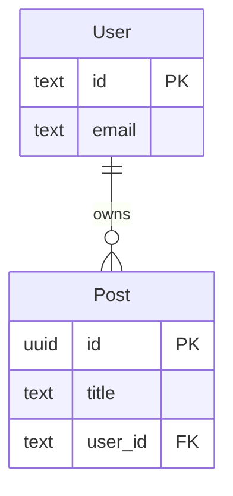

# Documentation Guide

> **TL;DR**: Keep docs focused, use visuals for complex concepts, organize by topic, update when code changes.

## Core Principles

- ✅ **Focused**: Document what's necessary, not everything
- ✅ **Visual**: Use diagrams for complex concepts (schemas, workflows, architecture)
- ✅ **Updated**: Keep docs in sync with code changes
- ✅ **Consistent**: Follow project conventions and style guides
- ❌ **Don't document**: Minor bug fixes, internal refactoring, temporary changes

## Audience

### Know your audience

- **Developers**: Technical details, API references, architecture, setup procedures
- **Users**: How-to guides, feature descriptions, troubleshooting
- **Contributors**: Contribution guidelines, development workflow, code standards

Write for your primary audience, but make it accessible. Use clear language and provide context.

## Directory Structure

### Recommended Structure

**Note:** Documentation should always be in `.docs/` directory at the repository root.

```text
project-root/
├── README.md                    # Project overview, features, tech stack, quick start
├── SETUP.md                     # Detailed setup instructions, configuration, environment variables
├── CONTRIBUTING.md              # Contribution guidelines and development workflow
├── CHANGELOG.md                 # Version history and release notes
│
└── .docs/                        # Documentation directory (always use .docs)
    ├── DOCUMENTATION_GUIDE.md   # This guide - documentation best practices
    │
    ├── guides/                   # Developer guides and tutorials
    │   ├── README.md            # Overview of all guides
    │   ├── getting-started.md  # Getting started guide for new developers
    │   ├── development.md       # Development workflow and best practices
    │   ├── deployment.md         # Deployment guide and procedures
    │   └── troubleshooting.md   # Common issues and solutions
    │
    ├── db/                      # Database documentation
    │   ├── README.md            # Database overview
    │   ├── schema.md           # Database schema overview and table descriptions
    │   ├── migrations.md        # Migration history and process documentation
    │   └── db.puml             # Entity relationship diagram (PlantUML)
    │
    ├── api/                     # API documentation
    │   ├── README.md            # API overview
    │   ├── endpoints.md         # API endpoint reference with request/response examples
    │   ├── authentication.md   # Authentication and authorization documentation
    │   └── workflows.md         # API workflow diagrams and sequences
    │
    ├── workflow/                 # Process documentation
    │   ├── process.md            # Workflow description
    │   └── process.puml          # Workflow sequence diagram
    │
    └── architecture/            # System design documentation
        ├── overview.md         # System architecture overview
        └── components.md       # Component diagrams and relationships
```

### Subdirectory README Files

#### Add README.md in subdirectories when:

- ✅ Subdirectory has multiple related files
- ✅ You want to provide an overview or quick reference
- ✅ The subdirectory is a major documentation section

#### Skip when:

Subdirectory has only one or two files, or purpose is obvious from file names.

**Example: `.docs/db/README.md`**

```markdown
# Database Documentation

- `schema.md` - Complete database schema overview
- `migrations.md` - Migration history and procedures
- `db.puml` - Entity relationship diagram

See [schema.md](./schema.md) for the complete schema documentation.
```

## Visual Documentation

### Inline Diagrams: Use Mermaid

For diagrams embedded directly in Markdown files, use **Mermaid**. Mermaid is natively supported by GitHub, GitLab, VS Code, and many other platforms.

#### Example: ER Diagram (Inline)

````markdown
## Database Schema


````

````

#### Example: Sequence Diagram (Inline)
```markdown
## User Workflow

```mermaid
sequenceDiagram
    actor User
    participant WebApp as Web App
    participant API
    participant DB as Database

    User->>WebApp: Submit form
    WebApp->>API: createItem()
    API->>DB: INSERT item
````

````

### Separate Files: Use PlantUML

For diagrams stored as separate `.puml` files, use **PlantUML**. These files are typically referenced from multiple documents or need to be version controlled separately.

#### Example: Reference PlantUML file
```markdown
## Database Schema

See the [entity relationship diagram](./db.puml) for the complete schema.
````

**PlantUML file format** (`.puml` files):

```plantuml
@startuml
entity User {
  * id : text
  * email : text
}

entity Post {
  * id : uuid
  * title : text
  user_id : text <<FK>>
}

User ||--o{ Post : "owns"
@enduml
```

### Decision: Embed vs Separate File

#### Embed Mermaid in markdown when:

Diagram provides real value and is relevant to the document, even if complex. Good for overviews, workflows, and visual summaries that enhance understanding.

#### Use separate `.puml` file (PlantUML) when:

Diagram is referenced from multiple documents, part of a collection, or needs to be version controlled separately.

## Code Comments vs Documentation

#### Use code comments for:

Explaining "why" implementation choices, complex algorithms, workarounds, non-obvious behavior.

#### Use documentation for:

High-level architecture, API endpoints, setup procedures, workflows, user-facing features.

**Example: Code Comment**

```typescript
// Use profile table instead of user to support both authenticated and anonymous users
// This allows us to track data for users who haven't signed up yet
const profile = await db.query.profile.findFirst({
  where: eq(profile.id, profileId),
});
```

**Example: Documentation**

```markdown
## User Profiles

The `profile` table decouples authentication from user data:

- **Authenticated users**: Linked to `user` via `user_id`
- **Anonymous users**: No `user_id`, used for guest sessions
```

## When to Document

| Change Type         | Document                                               | Don't Document                              |
| ------------------- | ------------------------------------------------------ | ------------------------------------------- |
| **Schema/Database** | New tables, columns, relationships, migrations         | Minor schema tweaks, index additions        |
| **API**             | New/modified endpoints, auth changes, breaking changes | Internal API refactoring, parameter renames |
| **Component/UI**    | New features, major changes, workflow changes          | UI styling changes, minor bug fixes         |
| **Configuration**   | New env vars, setup changes, deployment changes        | Config value updates, default changes       |
| **Architecture**    | System design changes, new services, integrations      | Internal refactoring, code reorganization   |

## Examples

### ✅ Good: Database Schema

```markdown
## Database Schema

The database uses the following core tables:

- `user` - User accounts (authentication)
- `post` - User posts
- `comment` - Post comments

See [Entity Relationship Diagram](./db.puml) for complete schema.
```

### ❌ Bad: Database Schema

```markdown
## Database Schema

The database has many tables including user, session, account, verification,
profile, post, comment, tag, category, author, publisher, editor, reviewer,
moderator, admin, and many more. Each table has many columns and relationships.
The database is complex and uses an ORM for queries...
```

### ✅ Good: API Documentation

````markdown
## API Endpoints

### Create Post

`POST /api/posts`

#### Request:

```json
{
  "title": "My Post",
  "content": "Post content"
}
```
````

#### Response:

```json
{
  "id": "uuid",
  "title": "My Post",
  "created_at": "2025-01-15T10:30:00Z"
}
```

#### Errors:

- `400 Bad Request` - Invalid title or content
- `401 Unauthorized` - Missing or invalid authentication

```

### ❌ Bad: Repetitive Documentation

Avoid repeating the same information in multiple sections. If information is mentioned once, don't repeat it verbatim elsewhere. Instead, use cross-references or consolidate related information.

**Example of repetitive documentation:**
- Mentioning test file naming conventions in 3 different sections
- Repeating E2E test exclusion details multiple times
- Duplicating database configuration information across sections

**Better approach:**
- Mention key information once in the most relevant section
- Use cross-references to related sections
- Consolidate related information into a single section

```

## Docs-as-Code Approach

#### Best practices:

- ✅ Store documentation in version control (Git)
- ✅ Update docs in the same PR as code changes
- ✅ Review documentation changes in code reviews
- ✅ Use plain text formats (**Markdown**, Mermaid for inline, PlantUML for .puml files)
- ✅ Keep diagrams synchronized with code changes
- ✅ Commit documentation changes with related code changes
- ✅ Use descriptive commit messages: `docs: update API endpoint documentation`

#### Regular maintenance:

- Review documentation quarterly or after major releases
- Verify all links still work
- Update examples to match current code
- Remove obsolete sections

## Consistency and Style

#### Maintain consistency:

- ✅ Use consistent terminology across all docs
- ✅ Follow the same structure for similar documentation types
- ✅ Use consistent formatting (headings, code blocks, lists)

## Discoverability and Cross-Referencing

#### Make documentation discoverable:

- ✅ Use clear, descriptive file names
- ✅ Add cross-references between related documents
- ✅ Link from README to relevant documentation sections
- ✅ Use consistent heading structure for easy navigation

**Example: Cross-referencing**

```markdown
## Database Schema

The database uses the following core tables:

- `user` - User accounts (authentication)
- `post` - User posts
- `comment` - Post comments

See [Entity Relationship Diagram](./db.puml) for complete schema.
See [Migration Guide](./migrations.md) for migration procedures.
See [API Documentation](../api/endpoints.md) for API usage.
```

## Quick Reference

### Documentation Checklist

Before creating a PR:

- [ ] Run `docs:check` (if available) to identify needed updates
- [ ] Review changed files and determine documentation impact
- [ ] Update relevant documentation files
- [ ] Update Mermaid diagrams (inline) or PlantUML files (.puml) if schemas/workflows changed
- [ ] Ensure setup instructions are accurate
- [ ] Verify README reflects current features
- [ ] Check that all links work
- [ ] Update code comments if needed
- [ ] Add subdirectory README if adding new major section

### Common Tasks

#### Adding a new feature:

1. Update README with feature description
2. Add API docs if it exposes new endpoints
3. Create workflow diagram if process is complex

#### Changing database schema:

1. Update schema documentation
2. Update ER diagram (`.puml` file for PlantUML, or inline Mermaid)
3. Update migration documentation if process changed

#### Modifying API:

1. Update API documentation
2. Update workflow diagrams if flows changed
3. Document breaking changes prominently

#### Adding new documentation section:

1. Create subdirectory in `.docs/`
2. Add README.md if section has multiple files
3. Link to new section from main README
4. Add cross-references to related sections

### Finding Documentation

Search for: Root-level markdown files, `.docs/` directory and subdirectories, README.md files in subdirectories, inline code comments, configuration files with comments.

### Tools

**Checking for updates:**

```bash
# Use your project's documentation check command
# Examples: npm run docs:check, bun run docs:check, yarn docs:check
```

## Summary

Effective documentation:

- ✅ Is **focused** and **concise**
- ✅ Uses **visuals** for complex concepts
- ✅ **Adapts** to project structure and needs
- ✅ Is **discoverable** and **up-to-date**
- ✅ Answers **why** not just **what**
- ✅ Provides **context** and **examples**
- ✅ Maintains **consistency** across all docs
- ✅ Keeps **code comments** and **documentation** in sync
