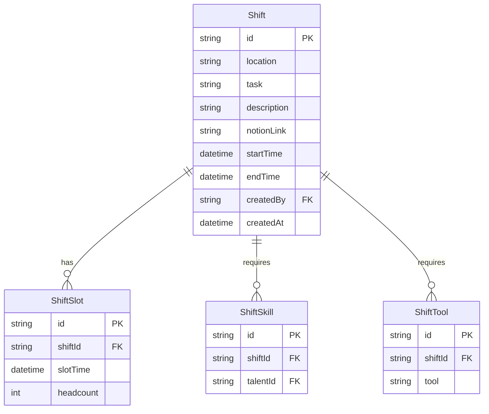

# Shift Planning Documentation

Documentation for the Q-Summit 2026 volunteer shift planning system.

## Overview

The Shift Planning feature enables Chair and Board members to create, manage, and coordinate volunteer shifts for the Q-Summit event. It provides tools for scheduling shifts, assigning required skills and equipment, and exporting data for external coordination.

## Quick Links

- [Workflow](./workflow.md) - How to create and manage shifts
- [CSV Format](./csv-format.md) - Export format specification
- [Role Access](./role-access.md) - Who can access what
- [API Reference](./api-reference.md) - Technical endpoint documentation

## Key Features

- **Shift Creation**: Define shifts with location, task, time slots, and requirements
- **Calendar View**: Visualize shifts across the event days (April 9-10, 2026)
- **List View**: Browse and filter all shifts
- **CSV Export**: Export shift data for external tools (Excel, Google Sheets)
- **Role-Based Access**: Restricted to Chair and Board members

## Data Model

A shift consists of:

- **Basic Info**: Location, task description, optional Notion documentation link
- **Time Schedule**: Start and end times with 30-minute slot granularity
- **Requirements**: Required skills (talents) and tools/equipment
- **Headcount**: Number of volunteers needed per time slot

## Related Documentation

- [Development Setup](../guides/dev-setup.md) - Local development instructions
- [Database Schema](../db/schema.md) - Full database documentation
- [Authentication](../guides/flows/login-flow.md) - Auth flows and procedures
