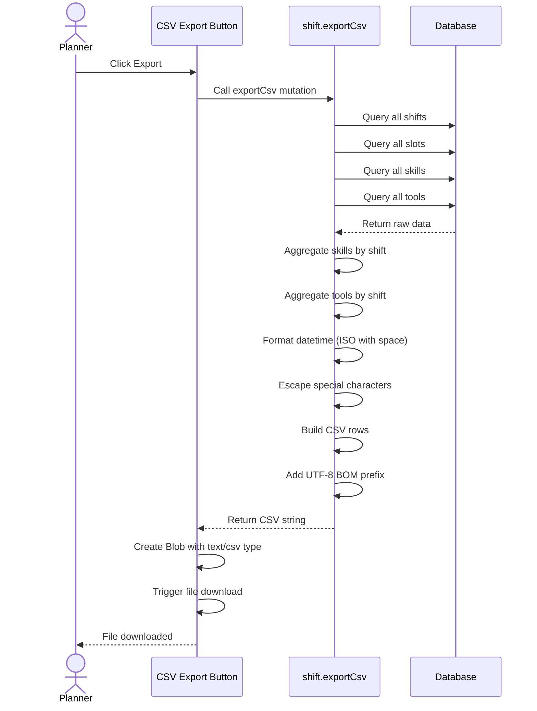

# CSV Export Format

Specification for the shift data CSV export.

## Overview

The CSV export feature allows planners to download all shift data for use in external tools like Excel, Google Sheets, or other planning software. The format is optimized for German Excel compatibility.

## File Format

### Encoding

- **UTF-8 with BOM**: The file starts with a UTF-8 Byte Order Mark (`\uFEFF`) for proper character encoding in Excel
- **Line endings**: Unix-style (`\n`)

### Delimiter

- **Semicolon (`;`)**: Used instead of comma for German Excel compatibility
- German Excel uses semicolon as the default list separator

### Escaping

Fields containing semicolons, quotes, or newlines are wrapped in double quotes:

```
"Field with ; semicolon"
"Field with ""quotes"""
```

## Column Structure

| Column        | Type            | Description                     | Example                                |
| ------------- | --------------- | ------------------------------- | -------------------------------------- |
| `shift_id`    | UUID            | Unique identifier for the shift | `550e8400-e29b-41d4-a716-446655440000` |
| `location`    | String          | Where the shift takes place     | `Main Hall`                            |
| `task`        | String          | Description of the work         | `Registration Check-in`                |
| `start_time`  | ISO DateTime    | When the shift begins           | `2026-04-09 08:00:00`                  |
| `end_time`    | ISO DateTime    | When the shift ends             | `2026-04-09 12:00:00`                  |
| `slot_time`   | ISO DateTime    | Specific 30-minute slot         | `2026-04-09 08:00:00`                  |
| `headcount`   | Integer         | Volunteers needed for this slot | `2`                                    |
| `skills`      | Comma-separated | Required talent IDs             | `tech-support,first-aid`               |
| `tools`       | Comma-separated | Required tools                  | `car,equipment`                        |
| `notion_link` | URL             | Documentation link (optional)   | `https://notion.so/page`               |

## Header Row

```
shift_id;location;task;start_time;end_time;slot_time;headcount;skills;tools;notion_link
```

## Example Data

### Single Shift with Multiple Slots

A shift from 08:00 to 10:00 with 30-minute slots:

```csv
shift_id;location;task;start_time;end_time;slot_time;headcount;skills;tools;notion_link
550e8400-e29b-41d4-a716-446655440000;Main Hall;Registration;2026-04-09 08:00:00;2026-04-09 10:00:00;2026-04-09 08:00:00;2;tech-support;car;https://notion.so/page
550e8400-e29b-41d4-a716-446655440000;Main Hall;Registration;2026-04-09 08:00:00;2026-04-09 10:00:00;2026-04-09 08:30:00;2;tech-support;car;https://notion.so/page
550e8400-e29b-41d4-a716-446655440000;Main Hall;Registration;2026-04-09 08:00:00;2026-04-09 10:00:00;2026-04-09 09:00:00;3;tech-support;car;https://notion.so/page
550e8400-e29b-41d4-a716-446655440000;Main Hall;Registration;2026-04-09 08:00:00;2026-04-09 10:00:00;2026-04-09 09:30:00;3;tech-support;car;https://notion.so/page
```

**Note:** The same shift appears multiple times, once per slot. This allows different headcounts per time slot.

### Multiple Shifts

```csv
shift_id;location;task;start_time;end_time;slot_time;headcount;skills;tools;notion_link
550e8400-e29b-41d4-a716-446655440000;Main Hall;Registration;2026-04-09 08:00:00;2026-04-09 10:00:00;2026-04-09 08:00:00;2;tech-support;car;
550e8400-e29b-41d4-a716-446655440001;Cafeteria;Food Service;2026-04-09 09:00:00;2026-04-09 14:00:00;2026-04-09 09:00:00;4;cooking;none;https://notion.so/food
550e8400-e29b-41d4-a716-446655440001;Cafeteria;Food Service;2026-04-09 09:00:00;2026-04-09 14:00:00;2026-04-09 09:30:00;4;cooking;none;https://notion.so/food
```

### Empty Export

When no shifts exist:

```csv
shift_id;location;task;start_time;end_time;slot_time;headcount;skills;tools;notion_link
```

Only the header row is included.

## DateTime Format

Dates are formatted as ISO 8601 with a space separator:

```
YYYY-MM-DD HH:MM:SS
```

**Examples:**

- `2026-04-09 08:00:00` - April 9, 2026 at 8:00 AM
- `2026-04-09 14:30:00` - April 9, 2026 at 2:30 PM

**Note:** The `T` separator is replaced with a space for better Excel compatibility.

## Skills and Tools Format

### Skills

Skills are stored as comma-separated talent IDs:

```
tech-support,first-aid,customer-service
```

If no skills are required, the field is empty.

### Tools

Tools are stored as comma-separated values from the allowed set:

```
car,van,equipment
```

Allowed values: `car`, `van`, `equipment`, `none`

If no tools are required, the field is empty.

## Special Characters

### Location and Task Fields

If location or task contains special characters, they are escaped:

| Input                | CSV Output               |
| -------------------- | ------------------------ |
| `Room A; Building 1` | `"Room A; Building 1"`   |
| `Task with "quotes"` | `"Task with ""quotes"""` |
| `Multi\nline`        | `"Multi\nline"`          |

### Notion Link

The Notion link field is optional and may be empty:

```csv
shift_id;location;task;...;notion_link
550e8400...;Main Hall;Registration;...;https://notion.so/page
550e8401...;Cafeteria;Cleanup;...;
```

## Usage in Excel

### Opening in German Excel

1. Open Excel
2. Go to **Data** > **From Text/CSV**
3. Select the downloaded file
4. Set encoding to **UTF-8**
5. Set delimiter to **Semicolon**
6. Click **Load**

### Opening in Google Sheets

1. Open Google Sheets
2. Go to **File** > **Import**
3. Upload the CSV file
4. Select **Semicolon** as separator
5. Click **Import data**

## Programmatic Usage

### Python (pandas)

```python
import pandas as pd

# Read with semicolon delimiter and UTF-8 encoding
df = pd.read_csv('shifts-export.csv', sep=';', encoding='utf-8-sig')

# The utf-8-sig encoding handles the BOM automatically
print(df.head())
```

### JavaScript/Node.js

```javascript
const fs = require("fs");

// Read and parse CSV
const csv = fs.readFileSync("shifts-export.csv", "utf8");
const lines = csv.trim().split("\n");
const headers = lines[0].split(";");

const data = lines.slice(1).map((line) => {
  const values = line.split(";");
  return headers.reduce((obj, header, i) => {
    obj[header] = values[i];
    return obj;
  }, {});
});

console.log(data);
```

## Export Process



## Limitations

- **Read-only**: The export is one-way; changes cannot be imported back
- **No history**: Previous versions of shifts are not included
- **Current state only**: Only the latest shift data is exported
- **No user assignments**: Individual volunteer assignments are not included (future feature)

## Related Documentation

- [Workflow](./workflow.md) - How to create and manage shifts
- [Role Access](./role-access.md) - Who can export data
- [API Reference](./api-reference.md) - Technical details of the export endpoint
