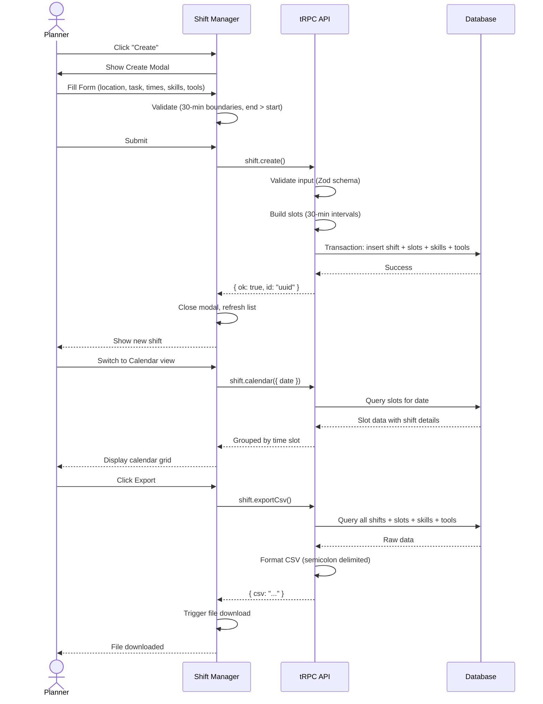

# Shift Planning Workflow

How to create and manage volunteer shifts for Q-Summit 2026.

## Prerequisites

- You must be logged in with planner access (Chair/Board role or `isHeadOf = true`)
- Access the shift planning page via the main navigation

## Creating a New Shift

### Step 1: Open the Create Form

1. Navigate to the Shifts page
2. Click the **Create** button (visible only to planners)
3. The shift creation modal opens

### Step 2: Enter Basic Information

| Field    | Required | Description                                                          |
| -------- | -------- | -------------------------------------------------------------------- |
| Location | Yes      | Where the shift takes place (e.g., "Main Hall", "Registration Desk") |
| Task     | Yes      | Brief description of the work (e.g., "Registration Check-in")        |

### Step 3: Set Time Schedule

| Field      | Required | Description                                    |
| ---------- | -------- | ---------------------------------------------- |
| Start Time | Yes      | When the shift begins (30-minute increments)   |
| End Time   | Yes      | When the shift ends (must be after start time) |

**Time Slot Rules:**

- Times must be on 30-minute boundaries (e.g., 09:00, 09:30, 10:00)
- The system automatically generates 30-minute slots between start and end times
- Each slot starts with 0 headcount and can be customized

### Step 4: Configure Headcount per Slot

By default, all slots have 0 headcount. To customize:

1. Pass slot data when creating via API, or
2. The system creates slots automatically with 0 headcount

Each slot represents a 30-minute window where volunteers are needed.

### Step 5: Select Required Skills

Choose skills from the categorized talent list:

- Skills are grouped by category (e.g., "Technical", "Logistics", "Communication")
- Select all that apply
- These help match volunteers to appropriate shifts

### Step 6: Select Required Tools

Available tool options:

| Tool      | Description                              |
| --------- | ---------------------------------------- |
| Car       | Volunteer needs a car for transportation |
| Van       | Volunteer needs a van                    |
| Equipment | Special equipment required               |
| None      | No special tools needed                  |

### Step 7: Add Documentation (Optional)

| Field       | Description                              |
| ----------- | ---------------------------------------- |
| Notion Link | Link to detailed documentation in Notion |
| Description | Additional details about the shift       |

**Notion URL Validation:**

- Must be a valid URL
- Must be on notion.so domain (or subdomain)

### Step 8: Submit

1. Review all fields
2. Click **Create Shift**
3. The modal closes and the shift appears in the list/calendar

## Managing Existing Shifts

### Viewing Shifts

Two view modes are available:

**List View:**

- Shows all shifts in a scrollable list
- Displays location, task, time range, and total headcount
- Supports filtering by location and date range

**Calendar View:**

- Shows shifts by day (April 9-10, 2026)
- Groups shifts by hour
- Shows volunteer count per time slot
- Navigate between days with arrow buttons

### Editing a Shift

1. Find the shift in list or calendar view
2. Click to open the shift details
3. Modify fields as needed
4. Save changes

**Note:** Updating a shift replaces all slots, skills, and tools. The previous data is deleted and recreated.

### Deleting a Shift

1. Locate the shift you want to remove
2. Use the delete action (requires planner role)
3. Confirm deletion
4. The shift and all associated slots are permanently removed

## Exporting Shift Data

### CSV Export

Planners can export all shift data to CSV:

1. Switch to **List View** (export is available here)
2. Click the **Export** button
3. The CSV file downloads automatically

**Export Contents:**

- All shifts with their slots
- Skills and tools for each shift
- Formatted for German Excel compatibility

See [CSV Format](./csv-format.md) for detailed format specification.

## Workflow Diagram

## Best Practices

1. **Be Specific**: Use clear location names and task descriptions
2. **Plan Ahead**: Create shifts well before the event
3. **Document**: Link to Notion pages for complex tasks
4. **Review**: Check calendar view to spot scheduling conflicts
5. **Export Regularly**: Keep backups of shift data

## Troubleshooting

| Issue                                 | Solution                                          |
| ------------------------------------- | ------------------------------------------------- |
| "End time must be after start time"   | Ensure end time is later than start time          |
| "Must be on 30-minute boundary"       | Round times to nearest 30 minutes (:00 or :30)    |
| "Only Chair/Board members can access" | Contact an admin to get planner permissions       |
| Export button not visible             | Switch to List view; only planners see the button |
